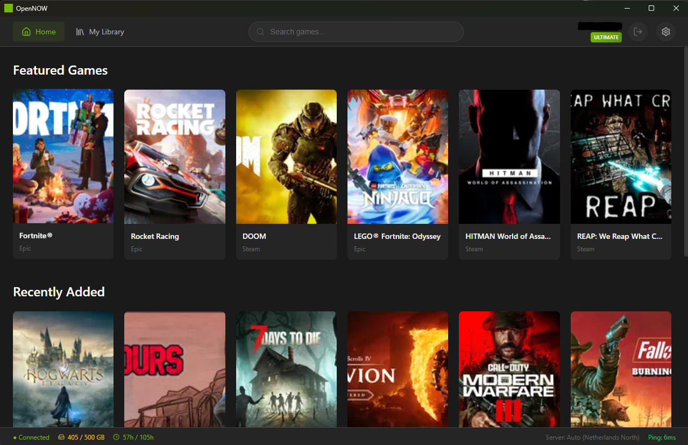

<h1 align="center">OpenNOW</h1>

<p align="center">
  <strong>Open source GeForce NOW client built from the ground up</strong>
</p>

<p align="center">
  <a href="https://github.com/zortos293/GFNClient/releases">
    
  </a>
  <a href="https://github.com/zortos293/GFNClient/stargazers">
    
  </a>
  <a href="https://github.com/sponsors/zortos293">
    
  </a>
</p>

--- 
## Disclaimer

This is an **independent project** not affiliated with NVIDIA Corporation. Created through reverse engineering for educational purposes. GeForce NOW is a trademark of NVIDIA. Use at your own risk.


---

## About

OpenNOW is a custom GeForce NOW client created by reverse engineering the official NVIDIA client. Built with Tauri (Rust + TypeScript), it removes artificial limitations and gives you full control over your cloud gaming experience.

**Why OpenNOW?**
- No artificial limitations on FPS, resolution, or bitrate
- Privacy focused - telemetry disabled by default
- Open source and community-driven
- Works on Windows, macOS, and Linux

---

## Screenshot

<p align="center">
  
</p>

---

## Download

<p align="center">
  <a href="https://github.com/zortos293/GFNClient/releases/latest">
    
  </a>
  <a href="https://github.com/zortos293/GFNClient/releases/latest">
    
  </a>
  <a href="https://github.com/zortos293/GFNClient/releases/latest">
    
  </a>
</p>

---

## Features

### Streaming
| Feature | Description |
|---------|-------------|
| **High FPS Modes** | 60, 120, 240, and 360 FPS streaming |
| **4K & 5K Resolutions** | Up to 5120x2880, ultrawide support (21:9, 32:9) |
| **Video Codecs** | H.264, H.265 (HEVC), and AV1 |
| **Audio Codecs** | Opus mono and stereo |
| **Unlimited Bitrate** | Up to 200 Mbps (no artificial caps) |
| **NVIDIA Reflex** | Low-latency mode for competitive gaming |

### Input & Controls
| Feature | Description |
|---------|-------------|
| **Raw Mouse Input** | 1:1 movement with `pointerrawupdate` events |
| **Unadjusted Movement** | Bypasses OS mouse acceleration |
| **Clipboard Paste** | Paste text directly into games (Ctrl+V) |
| **Full Keyboard Capture** | All keys captured in fullscreen |

### Experience
| Feature | Description |
|---------|-------------|
| **Discord Rich Presence** | Shows current game with optional stats |
| **Multi-Region Support** | Connect to any GFN server region |
| **Privacy Focused** | Telemetry disabled by default |
| **GPU Accelerated** | Hardware video decoding (Windows) |
| **Dark UI** | Modern, clean interface |

---

## Building

```bash
git clone https://github.com/zortos293/GFNClient.git
cd GFNClient
bun install
bun run tauri dev
```

**Requirements:** Bun, Rust, Tauri CLI

---

## Troubleshooting


### macOS: "App is damaged" or won't open

macOS quarantines apps downloaded from the internet. To fix this, run:

```bash
xattr -d com.apple.quarantine /Applications/OpenNOW.app
```


If you encounter issues, please export your logs and attach them to your bug report:

1. Open **Settings** (gear icon in the top right)
2. Scroll down to the **Troubleshooting** section
3. Click **Export Logs**
4. Save the file and attach it to your [bug report](https://github.com/zortos293/GFNClient/issues/new?template=bug_report.yml)

Logs are stored at:
- **Windows:** `%APPDATA%\opennow\opennow.log`
- **macOS:** `~/Library/Application Support/opennow/opennow.log`
- **Linux:** `~/.local/share/opennow/opennow.log`

---

## Support the Project

If OpenNOW is useful to you, consider sponsoring to support development:

<p align="center">
  <a href="https://github.com/sponsors/zortos293">
    
  </a>
</p>


---


<p align="center">
  Made by <a href="https://github.com/zortos293">zortos293</a>
</p>
