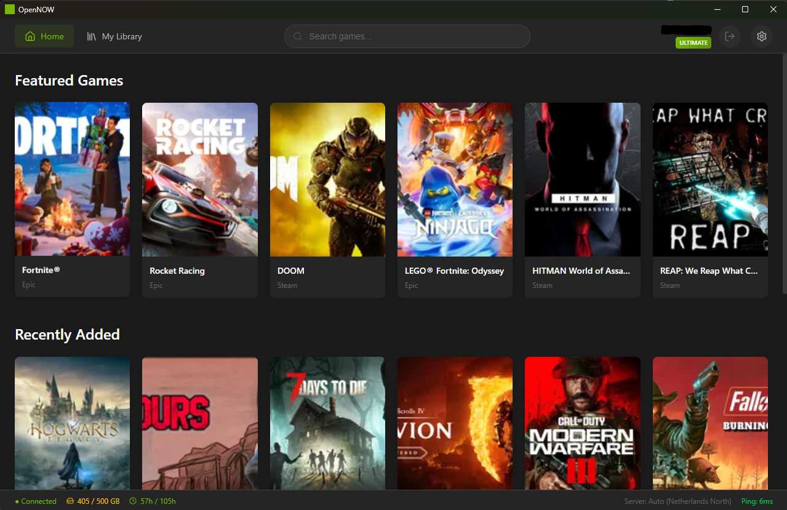

<h1 align="center">OpenNOW</h1>

<p align="center">
  
</p>

<p align="center">
  <strong>An open-source desktop client for GeForce NOW.</strong>
</p>

<p align="center">
  Browse the catalog, tune your stream, and launch sessions from a community-built app.
</p>

<p align="center">
  <a href="https://github.com/OpenCloudGaming/OpenNOW/releases">
    
  </a>
  <a href="https://testflight.apple.com/join/u1XPJKH2">
    
  </a>
  <a href="https://play.google.com/store/apps/details?id=com.opencloudgaming.opennow">
    
  </a>
  <a href="https://github.com/OpenCloudGaming/OpenNOW-Switch/releases/latest">
    
  </a>
  <a href="https://opennow.zortos.me">
    
  </a>
  <a href="https://github.com/OpenCloudGaming/OpenNOW/actions/workflows/auto-build.yml">
    
  </a>
  <a href="https://discord.gg/8EJYaJcNfD">
    
  </a>
</p>

<p align="center">
  <a href="https://github.com/OpenCloudGaming/OpenNOW/stargazers">
    
  </a>
  <a href="https://github.com/OpenCloudGaming/OpenNOW/releases">
    
  </a>
  <a href="LICENSE">
    
  </a>
</p>

<p align="center">
  
</p>

> [!WARNING]
> OpenNOW is under active development. Expect occasional bugs, rough edges, and platform-specific issues while the client matures.
>
> Native streamer / native streaming is experimental. It defaults to the web streamer path unless enabled, issues can be platform-specific, and users may see fallback to Chromium/WebRTC. Report native-streamer problems on [GitHub Issues](https://github.com/OpenCloudGaming/OpenNOW/issues) or [Discord](https://discord.gg/8EJYaJcNfD).

> [!IMPORTANT]
> OpenNOW is an independent community project and is not affiliated with, endorsed by, or sponsored by NVIDIA. NVIDIA and GeForce NOW are trademarks of NVIDIA Corporation. You must use your own GeForce NOW account.

## Overview

OpenNOW is a community-built desktop client for playing GeForce NOW. The shipping
Electron implementation remains in [`opennow-stable/`](opennow-stable) while its
controller-first Qt Quick replacement is developed in [`opennow-qt/`](opennow-qt).
The complete parity and safe-removal gates are tracked in
[`docs/qt-migration.md`](docs/qt-migration.md); Electron stays supported until
those gates pass.

## Downloads

Grab the latest desktop build from [GitHub Releases](https://github.com/OpenCloudGaming/OpenNOW/releases).

### Run two instances on Windows

OpenNOW remains single-instance by default. To open one additional, independent client, start the installed executable with the `--secondary` switch from PowerShell or a shortcut:

```powershell
& "C:\path\to\OpenNOW.exe" --secondary
```

The secondary window is titled **OpenNOW — Secondary** and uses a separate persistent profile ending in `-secondary`, including its own sign-in, settings, cookies, cache, device ID, and native-streamer runtime state. Launching the same command again focuses the existing secondary window, so at most one primary and one secondary profile run concurrently. Update OpenNOW from the primary instance; updates are disabled in the secondary instance to avoid competing over the installed application. Screenshots and recordings remain shared under `Pictures\OpenNOW` and use collision-resistant filenames.

Each simultaneous cloud stream must be allowed by its GeForce NOW account. In practice, use separate accounts when running two sessions because GeForce NOW can reject or replace concurrent sessions from the same account. Only one window can be focused for keyboard and mouse input at a time; Discord Rich Presence can show only one activity when both profiles enable it.

- iOS beta: [join TestFlight](https://testflight.apple.com/join/u1XPJKH2). The SwiftUI prototype currently lives on the [`kief5555/ios` branch](https://github.com/OpenCloudGaming/OpenNOW/tree/kief5555/ios/ios/OpenNOWiOS) under `ios/OpenNOWiOS/`; that folder is not present on this branch.
- Android: download from [Google Play](https://play.google.com/store/apps/details?id=com.opencloudgaming.opennow).
- Nintendo Switch: download the latest native Horizon OS homebrew build from [OpenNOW-Switch Releases](https://github.com/OpenCloudGaming/OpenNOW-Switch/releases/latest). It supports controller-first catalog browsing and native WebRTC streaming with H.264 video, Opus audio, and low-latency input on modded Switch systems.

For macOS users looking for a more performant OpenNOW version, Jayian1890 maintains the separate [OpenNOW-Mac](https://github.com/OpenCloudGaming/OpenNOW-Mac) repository.

## Documentation

Canonical documentation lives at [opennow.zortos.me](https://opennow.zortos.me):

- [Getting Started](https://opennow.zortos.me/guides/getting-started/)
- [Development](https://opennow.zortos.me/development/)
- [Configuration](https://opennow.zortos.me/reference/configuration/)
- [WebRTC](https://opennow.zortos.me/reference/webrtc/)
- [Native Streamer](https://opennow.zortos.me/reference/native-streamer/)
- [Project Website](https://opennow.zortos.me/)

This repository intentionally does not carry duplicate long-form product, setup, development, native streamer, GStreamer packaging, or release workflow documentation.

## Repository Layout

```text
.
├── opennow-stable/          Active Electron desktop client
├── opennow-qt/              Qt Quick controller-first replacement shell
├── native/opennow-core/     Shell-neutral Rust application core
├── native/opennow-streamer/ Native Rust streaming infrastructure
├── locales/                 Crowdin-managed localization files
├── .github/                 Workflows, templates, and contributor metadata
├── AGENTS.md                Repository instructions for AI agents and contributors
├── LICENSE                  Project license
├── logo.png                 Project logo
└── img.png                  App preview image
```

## Sponsors

OpenNOW's CI usage is generously sponsored by [Blacksmith](https://www.blacksmith.sh/), helping keep builds and releases fast for the open-source project.

## Contributing

Contributions are welcome. Read the [contributing guide](.github/CONTRIBUTING.md), keep changes focused, and explain user-facing impact clearly. When changing localized copy, edit only `locales/en.json`; Crowdin manages the other locale files.

## Star History

<a href="https://www.star-history.com/?repos=OpenCloudGaming%2FOpenNOW&type=date&legend=top-left">
 <picture>
   <source media="(prefers-color-scheme: dark)" srcset="https://api.star-history.com/image?repos=OpenCloudGaming/OpenNOW&type=date&theme=dark&legend=top-left" />
   <source media="(prefers-color-scheme: light)" srcset="https://api.star-history.com/image?repos=OpenCloudGaming/OpenNOW&type=date&legend=top-left" />
   
 </picture>
</a>

## License

OpenNOW is licensed under the [MIT License](LICENSE).
