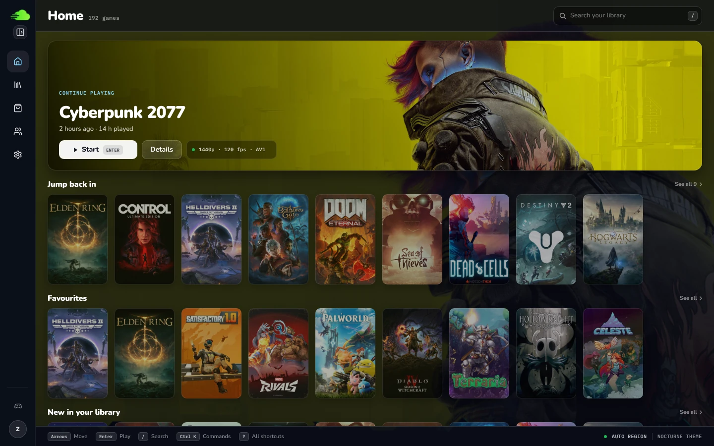
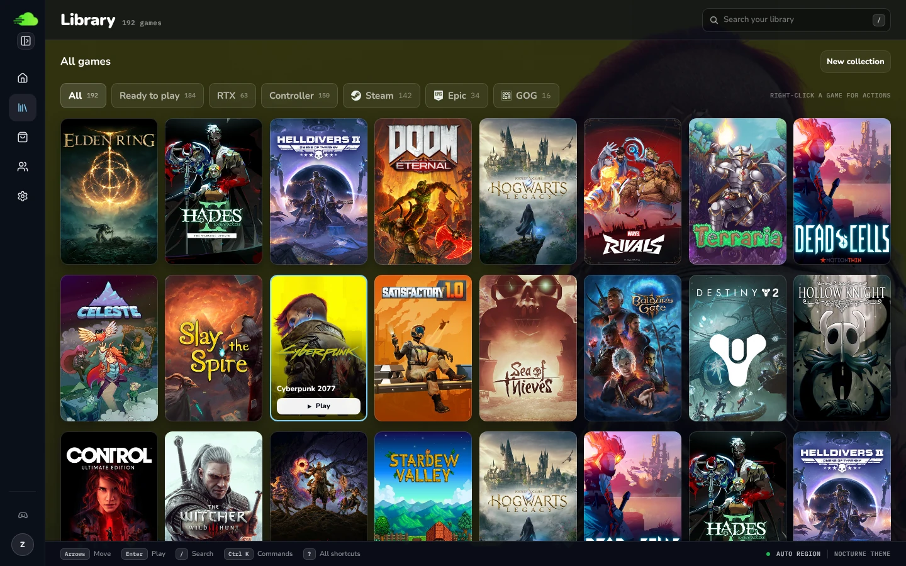
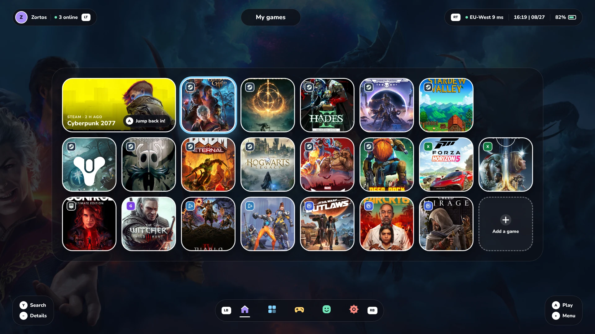

<p align="center">
  
</p>

<h1 align="center">OpenNOW</h1>

<p align="center"><strong>An open-source desktop client for GeForce NOW.</strong></p>

<p align="center">
  <a href="https://github.com/OpenCloudGaming/OpenNOW/releases"></a>
  <a href="https://opennow.zortos.me"></a>
  <a href="https://discord.gg/8EJYaJcNfD"></a>
</p>

<p align="center">
  <a href="https://github.com/OpenCloudGaming/OpenNOW/releases"></a>
  <a href="https://github.com/OpenCloudGaming/OpenNOW/stargazers"></a>
</p>

<p align="center">
  <a href="#get-opennow">Downloads</a> ·
  <a href="#inside-the-client">Features</a> ·
  <a href="#how-it-works">Architecture</a> ·
  <a href="#build-from-source">Build from source</a> ·
  <a href="#contributing">Contribute</a>
</p>

<p align="center">
  
</p>

<p align="center"><em>Desktop Home, from the OpenNOW Paper design.</em></p>

OpenNOW is a community-built GeForce NOW client. The desktop app uses Qt Quick for
the interface and Rust for account services and streaming. Use a keyboard and mouse,
or switch to the console layout for a controller. Both layouts run in the same app.

> [!IMPORTANT]
> You need your own GeForce NOW account. Your subscription, region, and hardware
> determine which games and stream settings you can use. OpenNOW is not affiliated
> with, endorsed by, or sponsored by NVIDIA. NVIDIA and GeForce NOW are trademarks
> of NVIDIA Corporation.

> [!WARNING]
> The Qt app is still under development. Expect bugs, including platform-specific
> streaming and GPU issues. It has no Chromium/WebRTC fallback. Publishing a build
> does not mean it has passed every check in the [acceptance checklist](docs/qt-acceptance.md).

## Get OpenNOW

Look for packages starting with `OpenNOW-Qt-` in
[GitHub Releases](https://github.com/OpenCloudGaming/OpenNOW/releases). Older releases
may contain the retired Electron app, so check the release notes before downloading.
If there's no published Qt nightly, sign in to GitHub and download the artifacts from a successful
[`qt-ci` run on `dev`](https://github.com/OpenCloudGaming/OpenNOW/actions/workflows/qt-ci.yml?query=branch%3Adev).

| Platform | Qt package | How to run it |
| --- | --- | --- |
| Windows x64 / ARM64 | Portable `.zip` | Extract the entire archive, then run `bin/OpenNOW.exe`. |
| Linux x64 / ARM64 | `.AppImage`, recommended | Make the file executable, then launch it. |
| Linux x64 / ARM64 | `.deb` | Your distribution must provide Qt 6.8+ and SDL3. Use the AppImage on stock Ubuntu 24.04. |
| macOS | No Qt nightly package | See the separate [OpenNOW-Mac](https://github.com/OpenCloudGaming/OpenNOW-Mac) project. |

Nightlies are unsigned. Windows may show an unknown-publisher warning, and you'll
need to download updates yourself. Checksums help detect corrupted downloads;
they don't verify who published a package.

The [nightly guide](docs/qt-nightly-release.md) covers these packages. For signed
builds and verified updates, read the [release-candidate guide](docs/qt-release-candidate.md).

### Other platforms

These projects are separate from the Qt desktop app.

- Try the iOS beta through [TestFlight](https://testflight.apple.com/join/u1XPJKH2).
  The SwiftUI prototype is on the [`kief5555/ios` branch](https://github.com/OpenCloudGaming/OpenNOW/tree/kief5555/ios/ios/OpenNOWiOS).
- Get the Android app from [Google Play](https://play.google.com/store/apps/details?id=com.opencloudgaming.opennow).
- Get [OpenNOW-Switch](https://github.com/OpenCloudGaming/OpenNOW-Switch/releases/latest)
  for a modded Nintendo Switch. It runs as native Horizon OS homebrew.

## Inside the client

These images come from the [OpenNOW Paper design](https://app.paper.design/file/01M11SPTRPMYQB9S9AX948A6WH/4-0).
The boards follow the current Qt layouts, but they aren't app screenshots. The games,
account details, and statistics are sample content, not proof of game availability or performance.

### Desktop library



### Controller-first console layout



You can:

- Browse the catalog, save favorites, and organize your library into collections.
- Set the resolution, frame rate, bitrate, and codec your account and device support.
- Open stream menus and statistics without leaving the video.
- Take screenshots and record the source stream to Matroska files. Find both in Media.
- Export a diagnostic report through Settings → About → Copy diagnostics when something breaks.

The [Qt app guide](opennow-qt/README.md) lists hardware requirements, experimental
features, and platform limitations.

## How it works

Qt draws the interface and handles windows, navigation, focus, and overlays.
The Rust core runs in a separate process. It manages accounts, settings, and catalog
requests, then prepares the session. Qt talks to it over a
[versioned JSON protocol](docs/core-protocol.md).

The native Rust streamer handles NVST transport, decoding, audio, gameplay input,
and recording. Qt loads it in the desktop process through a
[versioned C ABI](native/opennow-streamer/crates/opennow-streamer-ffi/README.md).
Video stays on the GPU, and Qt draws menus over it in the same window. The app doesn't
embed a browser or open a separate video window. The [streamer guide](native/opennow-streamer/README.md)
explains the graphics backends and how Qt uses them.

## Build from source

Use the `dev` branch for the Qt app. Before building, install:

- Qt 6.8+ with Quick, Multimedia, and ShaderTools.
- CMake 3.24+ and a C++20 toolchain.
- SDL3, Cargo, and the media dependencies for your platform.

Linux also needs `pkg-config`, `libwayland-dev`, and `wayland-protocols`, even for
X11 builds. Check the [build guide](opennow-qt/README.md#build) for platform-specific details.

```sh
git clone --branch dev https://github.com/OpenCloudGaming/OpenNOW.git
cd OpenNOW
cmake -S opennow-qt -B build/opennow-qt -DCMAKE_BUILD_TYPE=Debug
cmake --build build/opennow-qt
ctest --test-dir build/opennow-qt --output-on-failure
```

You don't need Node.js or npm to build or run the desktop app. The repository uses
JavaScript for tools such as the localization checker.

Testing login and gameplay requires a GeForce NOW account. Without one, you can
run the smoke tests, screenshot fixtures, and performance checks in the
[Qt app guide](opennow-qt/README.md) and [acceptance runbook](docs/qt-acceptance.md).

## Documentation

Start at [opennow.zortos.me](https://opennow.zortos.me) for setup and configuration help.

| For players | For contributors |
| --- | --- |
| [Getting started](https://opennow.zortos.me/guides/getting-started/) | [Development guide](https://opennow.zortos.me/development/) |
| [Configuration](https://opennow.zortos.me/reference/configuration/) | [Qt application](opennow-qt/README.md) |
| [Native streamer](https://opennow.zortos.me/reference/native-streamer/) | [Protocol, release, and acceptance docs](docs/) |

### Repository map

```text
opennow-qt/               Qt Quick desktop app, C++ integration, and Qt tests
native/opennow-core/      Rust accounts, settings, catalog, and session services
native/opennow-streamer/  Native NVST transport, media, input, and Qt FFI
locales/                 English source and Crowdin-managed translations
docs/                    Architecture, protocols, acceptance, and release guides
scripts/                 Repository-only localization tooling
.github/                 CI workflows and contributor guidance
```

## Contributing

For code changes, read the [contributing guide](.github/CONTRIBUTING.md) and
[repository guidance](AGENTS.md). Keep pull requests focused on one change.
For translations, edit only `locales/en.json`. Crowdin manages the other locale files.

Found a bug? Open a [GitHub issue](https://github.com/OpenCloudGaming/OpenNOW/issues)
with your build, OS, GPU, and steps to reproduce it. For streaming bugs, include a
diagnostic export. Check attachments for personal information before posting them.
You can also ask for help on [Discord](https://discord.gg/8EJYaJcNfD).

## Sponsors

[Blacksmith](https://www.blacksmith.sh/) sponsors OpenNOW's CI.

## Star history

<a href="https://www.star-history.com/?repos=OpenCloudGaming%2FOpenNOW&type=date&legend=top-left">
  <picture>
    <source media="(prefers-color-scheme: dark)" srcset="https://api.star-history.com/image?repos=OpenCloudGaming/OpenNOW&type=date&theme=dark&legend=top-left" />
    <source media="(prefers-color-scheme: light)" srcset="https://api.star-history.com/image?repos=OpenCloudGaming/OpenNOW&type=date&legend=top-left" />
    
  </picture>
</a>

## License

OpenNOW uses the [MIT License](LICENSE).
