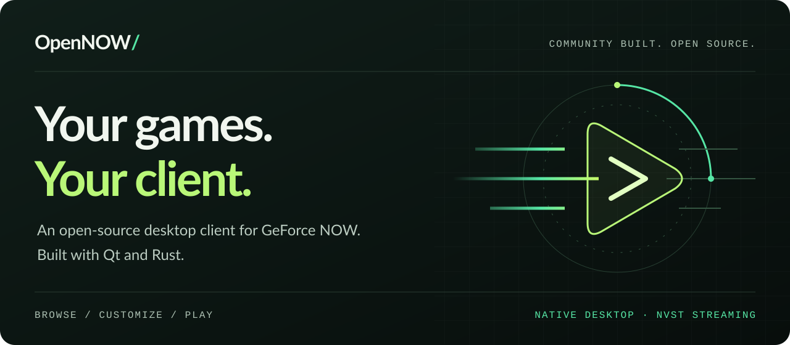
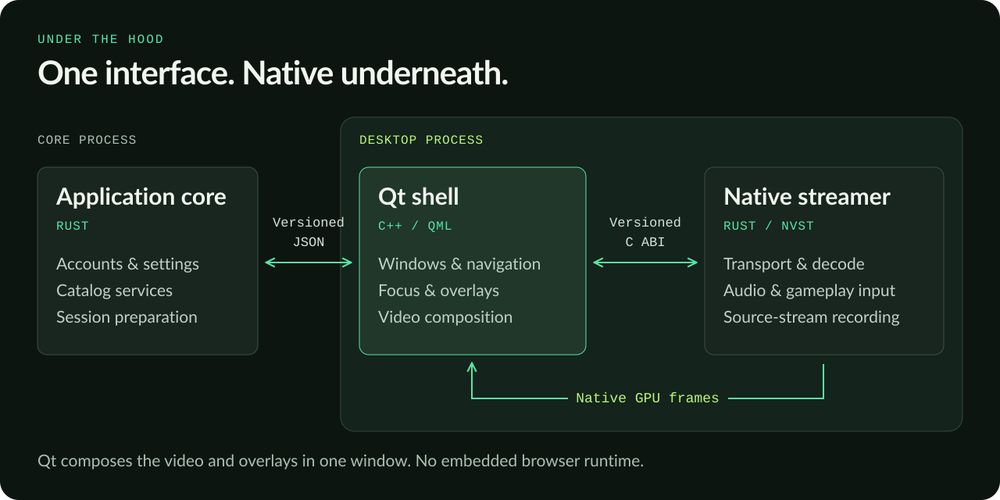

<p align="center">
  
</p>

<p align="center">
  <a href="https://github.com/OpenCloudGaming/OpenNOW/releases"></a>
  <a href="https://opennow.zortos.me"></a>
  <a href="https://discord.gg/8EJYaJcNfD"></a>
</p>

<p align="center">
  <a href="#get-opennow">Downloads</a> ·
  <a href="#inside-the-client">Features</a> ·
  <a href="#how-it-works">Architecture</a> ·
  <a href="#build-from-source">Build from source</a> ·
  <a href="#contributing">Contribute</a>
</p>

# OpenNOW

Browse the GeForce NOW catalog, organize your library, and tune your stream in a
community-built desktop app. OpenNOW pairs a **Qt Quick interface** with a **Rust
application core and native NVST streamer**. Desktop and controller-first console
layouts share the same application and streaming runtime.

> [!IMPORTANT]
> OpenNOW is an independent community project, not affiliated with, endorsed by, or
> sponsored by NVIDIA. You need your own GeForce NOW account; game access and stream
> options depend on your account, subscription, region, and hardware. NVIDIA and
> GeForce NOW are trademarks of NVIDIA Corporation.

> [!WARNING]
> The Qt/native desktop app is under active development. Streaming, GPU interoperability,
> and platform support still have release-acceptance work remaining. There is no
> Chromium/WebRTC desktop fallback. See the [acceptance checklist](docs/qt-acceptance.md)
> rather than assuming a published build has passed every platform gate.

## Get OpenNOW

Choose a **Qt nightly** from [GitHub Releases](https://github.com/OpenCloudGaming/OpenNOW/releases)
for the current desktop app. Historical releases may contain the retired Electron client;
check the release notes and look for `OpenNOW-Qt-…` packages.

| Platform | Current Qt nightly | Getting started |
| --- | --- | --- |
| Windows x64 / ARM64 | Portable `.zip` | Extract the entire archive, then run `bin/OpenNOW.exe`. |
| Linux x64 / ARM64 | `.AppImage` (recommended) | Make the file executable, then launch it. |
| Linux x64 / ARM64 | `.deb` | Requires distribution-provided Qt 6.8+ and SDL3. Use the AppImage on stock Ubuntu 24.04. |
| macOS | Not published by the current Qt nightly workflow | See the separate community-maintained [OpenNOW-Mac](https://github.com/OpenCloudGaming/OpenNOW-Mac) project. |

Nightlies are **unsigned and updated manually**. Windows may show an unknown-publisher
warning. Release checksums detect download corruption but are not publisher signatures.
See the [nightly guide](docs/qt-nightly-release.md) for package details and the
[release-candidate guide](docs/qt-release-candidate.md) for signed builds and verified updates.

### Other platforms

These are separate platform projects, not packages of the Qt desktop app.

- **iOS beta:** [Join TestFlight](https://testflight.apple.com/join/u1XPJKH2).
  The SwiftUI prototype lives on the [`kief5555/ios` branch](https://github.com/OpenCloudGaming/OpenNOW/tree/kief5555/ios/ios/OpenNOWiOS).
- **Android:** [Download from Google Play](https://play.google.com/store/apps/details?id=com.opencloudgaming.opennow).
- **Nintendo Switch:** [Download OpenNOW-Switch](https://github.com/OpenCloudGaming/OpenNOW-Switch/releases/latest),
  native Horizon OS homebrew for modded Switch systems.

## Inside the client

| | What you can do |
| --- | --- |
| **Catalog & library** | Browse games, keep favorites, and organize your library into collections. |
| **Desktop & console layouts** | Use keyboard and mouse on the desktop or navigate the controller-first shell. |
| **Stream settings** | Choose resolution, frame rate, bitrate, and codec within the options available to your account and device. |
| **In-session controls** | Open stream menus and statistics above the same native video surface. |
| **Screenshots & recordings** | Capture screenshots and source-stream Matroska recordings, then find them in Media. |
| **Diagnostics** | Export a bounded report from **Settings → About → Copy diagnostics** when a session misbehaves. |

Feature availability varies by platform and hardware. For rendering requirements,
experimental features, and current limitations, see the [Qt app guide](opennow-qt/README.md).

## How it works



- **Qt owns the interface:** windows, navigation, focus, overlays, and the embedded video item.
- **The Rust core owns application services:** accounts, settings, catalog requests, and complete session preparation, exposed through the [versioned JSON protocol](docs/core-protocol.md).
- **The native streamer owns media:** NVST negotiation, transport, decode, audio, gameplay input, and recording. Qt loads it in-process through a [versioned C ABI](native/opennow-streamer/crates/opennow-streamer-ffi/README.md).

Video stays on the native GPU presentation path, with Qt composing stream chrome above
the same surface. There is no second presenter window or embedded browser runtime.
See the [native streamer guide](native/opennow-streamer/README.md) for ownership and backend details.

## Build from source

The current Qt/native development line is **`dev`**. Install **Qt 6.8+** (Quick,
Multimedia, and ShaderTools), **CMake 3.24+**, a **C++20 toolchain**, **SDL3**, **Cargo**,
and the platform media dependencies before configuring. Linux also requires
`pkg-config`, `libwayland-dev`, and `wayland-protocols`, even for X11 builds.
Follow the [component build guide](opennow-qt/README.md#build) for platform-specific details.

```sh
git clone --branch dev https://github.com/OpenCloudGaming/OpenNOW.git
cd OpenNOW
cmake -S opennow-qt -B build/opennow-qt -DCMAKE_BUILD_TYPE=Debug
cmake --build build/opennow-qt
ctest --test-dir build/opennow-qt --output-on-failure
```

The desktop runtime does not require Node.js or npm. JavaScript tooling in this
repository is used only for tasks such as localization validation.

Full login and gameplay checks require a real GeForce NOW account. Account-free
smoke tests, screenshot fixtures, and performance workloads are documented in the
[Qt app guide](opennow-qt/README.md) and [acceptance runbook](docs/qt-acceptance.md).

## Documentation

General product documentation lives at **[opennow.zortos.me](https://opennow.zortos.me)**.

| For players | For contributors |
| --- | --- |
| [Getting started](https://opennow.zortos.me/guides/getting-started/) | [Development guide](https://opennow.zortos.me/development/) |
| [Configuration](https://opennow.zortos.me/reference/configuration/) | [Qt application](opennow-qt/README.md) |
| [Native streamer](https://opennow.zortos.me/reference/native-streamer/) | [Protocol, release, and acceptance docs](docs/) |

### Repository map

```text
opennow-qt/               Qt Quick desktop app, C++ integration, and Qt tests
native/opennow-core/      Rust accounts, settings, catalog, and session services
native/opennow-streamer/  Native NVST transport, media, input, and Qt FFI
locales/                 English source and Crowdin-managed translations
docs/                    Architecture, protocols, acceptance, and release guides
scripts/                 Repository-only localization tooling
.github/                 CI workflows and contributor guidance
```

## Contributing

Bug reports, focused fixes, documentation, and translations are welcome. Start with
the [contributing guide](.github/CONTRIBUTING.md) and [repository guidance](AGENTS.md).
For localization changes, edit only `locales/en.json`; Crowdin owns the other locales.

Report problems on [GitHub Issues](https://github.com/OpenCloudGaming/OpenNOW/issues)
or discuss them on [Discord](https://discord.gg/8EJYaJcNfD). For streaming bugs, include
your build, OS, GPU, reproduction steps, and a diagnostic export. Review attachments
for personal information before sharing them publicly.

## Sponsors

OpenNOW's CI usage is generously sponsored by [Blacksmith](https://www.blacksmith.sh/),
helping keep builds and releases fast for the open-source project.

## Star history

<a href="https://www.star-history.com/?repos=OpenCloudGaming%2FOpenNOW&type=date&legend=top-left">
  <picture>
    <source media="(prefers-color-scheme: dark)" srcset="https://api.star-history.com/image?repos=OpenCloudGaming/OpenNOW&type=date&theme=dark&legend=top-left" />
    <source media="(prefers-color-scheme: light)" srcset="https://api.star-history.com/image?repos=OpenCloudGaming/OpenNOW&type=date&legend=top-left" />
    
  </picture>
</a>

## License

OpenNOW is licensed under the [MIT License](LICENSE).
